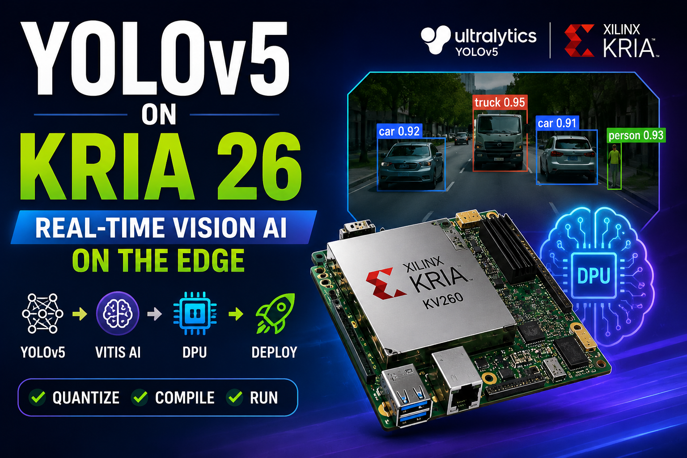

# 🚀 YOLOv5 Deployment on KRIA KV260 with Vitis AI



**Deploying YOLOv5 on AMD-Xilinx KRIA KV260 using Vitis AI Quantization and DPU Compilation**

---

## 📌 Overview

This repository demonstrates the complete workflow for deploying a custom-trained **YOLOv5** model on the **AMD-Xilinx KRIA KV260 Vision AI Starter Kit**.

The deployment flow includes:

* ✅ Modifying YOLOv5 for Vitis AI compatibility
* ✅ Retraining the modified network
* ✅ Quantizing the model using Vitis AI
* ✅ Exporting the `.xmodel` file
* ✅ Compiling for the KRIA DPU
* ✅ Running real-time object detection on the KV260

---

## 🎥 Live Demo

<p align="center">
  <a href="https://youtu.be/vi2XgS4sPvo">
    
  </a>
</p>

<p align="center">
  <b>▶ Click the thumbnail to watch the full deployment demo</b>
</p>


## 🏗️ Hardware

### Target Platform

* 🧠 AMD-Xilinx KRIA KV260
* ⚡ DPU Accelerator
* 🎥 USB Camera / Video Stream
* 🐧 Ubuntu + WSL Environment

---

## 🛠️ Software Requirements

* Ubuntu / WSL2
* Docker
* Python 3.8+
* PyTorch
* Vitis AI v1.4.1
* YOLOv5

---

## 📂 Project Workflow

```text
Train YOLOv5
      │
      ▼
Modify Network
      │
      ▼
Retrain Model
      │
      ▼
Quantization (INT8)
      │
      ▼
Generate XMODEL
      │
      ▼
Compile for DPU
      │
      ▼
Deploy on KV260
```

---

# 1️⃣ Vitis AI Setup

Clone Vitis AI:

```bash
git clone -b v1.4.1 --recurse-submodules https://github.com/Xilinx/Vitis-AI
```

Pull Docker image:

```bash
docker pull xilinx/vitis-ai-cpu:latest
```

Run Docker:

```bash
cd Vitis-AI
./docker_run.sh xilinx/vitis-ai-cpu:latest
```

Activate environment:

```bash
conda activate vitis-ai-pytorch
```

Clone YOLOv5:

```bash
git clone https://github.com/ultralytics/yolov5.git
```

---

# 2️⃣ Modify YOLOv5 for Vitis AI

## Replace SiLU Activation

Vitis AI does not support **SiLU**.

Replace:

```python
nn.SiLU()
```

with:

```python
nn.LeakyReLU(0.1, inplace=True)
```

Files:

```text
models/common.py
models/experimental.py
```

---

## Modify Detect Layer

Edit:

```text
models/yolo.py
```

Replace the Detect forward function:

```python
def forward(self, x):
    for i in range(self.nl):
        x[i] = self.m[i](x[i])
        bs, _, ny, nx = x[i].shape
        x[i] = x[i].view(
            bs,
            self.na,
            self.no,
            ny,
            nx
        ).permute(0,1,3,4,2).contiguous()
    return x
```

---

## ⚠️ Important

After modifying the architecture:

> The network must be retrained before quantization.

---

# 3️⃣ Quantization

Create:

```text
quant.py
```

Run calibration:

```bash
python quant.py --quant_mode calib
```

Output:

```text
quantize_result/
```

---

# 4️⃣ Generate XMODEL

Run:

```bash
python quant.py --quant_mode test
```

Expected output:

```text
compiled_xmodel/
└── DetectMultiBackend_int.xmodel
```

---

# 5️⃣ Compile for KRIA KV260

Compile the generated xmodel:

```bash
vai_c_xir \
-x ./compiled_xmodel/DetectMultiBackend_int.xmodel \
-a /opt/vitis_ai/compiler/arch/DPUCZDX8G/KV260/arch.json \
-o OUTPUTPATH \
-n yolov5_kv260
```

---

# ⚠️ DPU Subgraph Check

After compilation verify:

```text
DPU Subgraph = 1
```

If multiple subgraphs exist:

❌ Unsupported operators are present

This causes:

* PS execution
* CPU/DPU switching
* Increased latency
* Lower FPS

---

# 🔍 Model Visualization

Inspect the generated `.xmodel` using Netron:

```bash
netron DetectMultiBackend_int.xmodel
```

Useful for checking:

* Input tensors
* Output tensors
* Network structure

---

# 📊 Optimization Tips

* Use INT8 quantization
* Keep DPU subgraph count = 1
* Remove unsupported operators
* Reduce input resolution if required
* Use YOLOv5n or YOLOv5s for maximum FPS

---

# 🎥 Demo

The repository includes a live demonstration showing:

* Real-time object detection
* DPU accelerated inference
* YOLOv5 running on KRIA KV260

---

# 📚 References

* AMD Vitis AI Documentation
* YOLOv5 Repository
* KRIA KV260 Vision AI Starter Kit

---

## ⭐ Support

If this project helped you, consider giving it a ⭐ on GitHub.

```text
YOLOv5 → Quantize → Compile → DPU → Deploy on KRIA KV260
```
